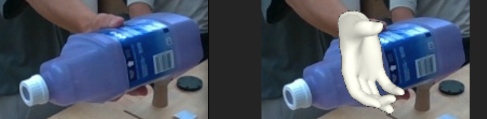

## Disclaimer

I (Hongsuk Choi) adapted the original repository to work on mano hand fitting and a multi-view environment. I tested on a sparse view environment with 7 cameras having large distance between each other. 

The code here
- Only works on fitting of the MANO hand model
- Supports multi-view loss optimization
- Supports hand mesh initialization
- Does not support penetration penalty loss
- Fits the global translation of **a single right hand** along with the MANO parameters. 



## Expressive Body Capture: 3D Hands, Face, and Body from a Single Image

[[Project Page](https://smpl-x.is.tue.mpg.de/)] 
[[Paper](https://ps.is.tuebingen.mpg.de/uploads_file/attachment/attachment/497/SMPL-X.pdf)]
[[Supp. Mat.](https://ps.is.tuebingen.mpg.de/uploads_file/attachment/attachment/498/SMPL-X-supp.pdf)]

## Installation
We recommend you to use an Anaconda virtual environment. Install PyTorch >= 1.2 and Python >= 3.7.2, 
> I tested on Python=3.9.17 and Pytorch=1.12.1+cu113, Ubuntu 20.04

and run 

```
pip install -r requirements.txt
```

For the visualization, you may want to install `pyrender`, `osmesa`, and `pyopengl=3.1.5`, especially if you are in a headless environment.

## Run

Prepare the input and run the command.

### Preparation
Prepare the input images, the camera paramters, the target 2D joints from OpenPose, and optionally the 3D mesh for initialization from [HandOccNet](https://github.com/namepllet/HandOccNet) as below.


```
${ROOT}  
|-- cfg_files
|-- smplifyx
|-- data  
|   |-- {YOUR_DATA}
|   |   |-- cam_params_final.json
|   |   |-- cam_0  
|   |   |   |-- 0_0000.jpg # {camera_idx}_{frame_idx}.jpg
|   |   |   |-- 0_0001.jpg
|   |   |   |-- ...
|   |   |   |-- 0_00xx.jpg
|   |   |-- cam_0_keypoints  
|   |   |   |-- 0_0000_keypoints.json # {camera_idx}_{frame_idx}_keypoints.jpg
|   |   |   |-- 0_0001_keypoints.json
|   |   |   |-- ...
|   |   |   |-- 0_00xx_keypoints.json
|   |   |-- cam_0_handoccnet  
|   |   |   |-- 0_0000_3dmesh.json # {camera_idx}_{frame_idx}_3dmesh.jpg
|   |   |   |-- 0_0001_3dmesh.json
|   |   |   |-- ...
|   |   |   |-- 0_00xx_3dmesh.json
|   |   |-- cam_1
|   |   |-- cam_2
|   |   |-- ...
|   |   |-- cam_N
```

The camera paramter format of `cam_params_final.json` should follow below. The example file is provided in our root.
``` 
{
    "0": {
        "fx": 425.4889026887061,
        "fy": 430.7943259159451,
        "cx": 430.4445264563152,
        "cy": 279.6149582222223,
        "rvec": [
            0.3339608481083653,
            2.73733697787857,
            -1.4295522094717098
        ],
        "tvec": [  # mm
            -63.6558868224938,
            57.78005258207216,
            1019.4000235204009
        ]
    },
    "1": {
      ...
      }
      ...
}
```

The OpenPose keypoint json file should follow this;
21 joints, an xy pixel location and a confidence score for each joint.
I (Hongsuk Choi) used the `demo.py` in my [modified Third Party Pytorch implementation](https://github.com/hongsukchoi/OpenPose_3rdParty/tree/hand_demo).

```
{"people": [{"person_id": [-1], "hand_right_keypoints_2d": [0.0, 0.0, 0.0, 0.0, 0.0, 0.0, 636.0, 355.0, 0.06826138362521306, 634.0, 352.0, 0.24912411883997265, 629.0, 352.0, 0.14821653296530712, 628.0, 387.0, 0.06968438968760893, 638.0, 352.0, 0.11099294096493395, 636.0, 350.0, 0.1676580902567366, 634.0, 354.0, 0.12640155653934926, 650.0, 376.0, 0.06368632723842893, 628.0, 378.0, 0.1792734507107525, 626.0, 386.0, 0.15592998130523483, 633.0, 401.0, 0.1534495425003115, 647.0, 392.0, 0.06607456789060961, 621.0, 405.0, 0.18786409020322026, 620.0, 414.0, 0.16799509730481077, 625.0, 430.0, 0.1239485044425237, 644.0, 410.0, 0.05767667422333034, 625.0, 425.0, 0.12532765278956504, 619.0, 433.0, 0.17665766569189145, 623.0, 442.0, 0.13531837027403526]}]}
```

The hand mesh for initialization should follow this
```
{"hand_scale": [1.0], "hand_translation": [-0.10323894768953323, -0.22464779019355774, 0.7796634435653687], "mano_pose": [2.0424962043762207, -1.138195514678955, 1.9308149814605713, -0.059017229825258255, -0.0981338620185852, 0.08398892730474472, 0.05025883764028549, -0.022952333092689514, 0.04885490611195564, 0.011113741435110569, -0.006226715166121721, -0.07336945086717606, -0.06902384012937546, -0.01620360277593136, 0.266135036945343, 0.037171442061662674, -0.014742912724614143, -0.10484116524457932, 0.014784198254346848, 0.005063728429377079, -0.04895014315843582, -0.01569502055644989, 0.010628524236381054, 0.09387016296386719, 0.10544180124998093, -0.08119232952594757, -0.0515563078224659, -0.05925048515200615, -0.04598933458328247, -0.07485625147819519, 0.07133205980062485, 0.007931197993457317, 0.17997293174266815, -0.005505507346242666, -0.024569351226091385, -0.24808090925216675, 0.006851261015981436, -0.062452930957078934, -0.025313865393400192, -0.17379391193389893, -0.003874188056215644, -0.13866987824440002, 0.03155672177672386, -0.019999608397483826, 0.10666453838348389, -0.005225136876106262, -0.03205733746290207, -0.12907089293003082], "mano_shape": [0.1784244179725647, 0.07427293807268143, -0.2038760483264923, -0.04109083488583565, 0.15177811682224274, -0.0399186909198761, -0.03479235991835594, 0.061008743941783905, -0.1765897572040558, -0.03453253209590912]}
```

Prepare the MANO model and the output directory.
Download [humand_model_file](https://drive.google.com/drive/folders/1lcUgY0np1dFYLZuxjz3Q-bLCJRMeA0dF?usp=drive_link) and place it whereever you want.

```
${ROOT}  
|-- cfg_files
|-- smplifyx
|-- data  
|-- output
|-- human_model_files
```

### Command

```Shell
python smplifyx/main.py --config cfg_files/fit_mano.yaml --data_folder ./data/{YOUR_DATA} --output_folder ./output/{YOUR_OUTPUT} --visualize=False --model_folder ./human_model_files
```

The code fits the global translation of the hand along with the MANO parameters. You can also fit the hand scale by adding `--fit_hand_scale`.


